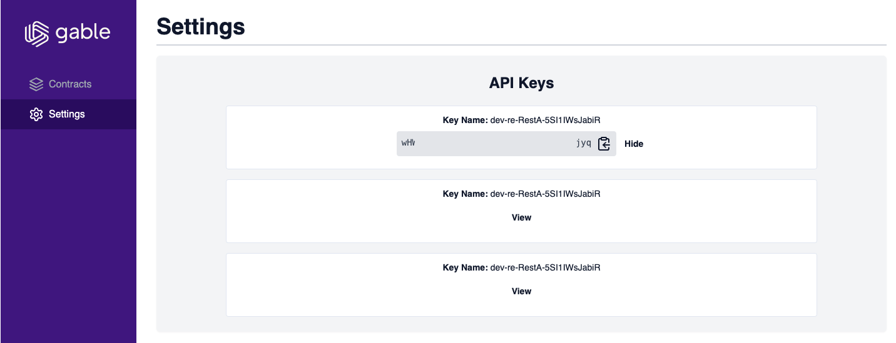
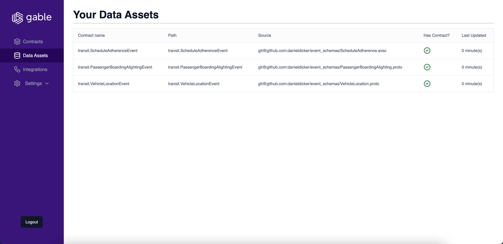
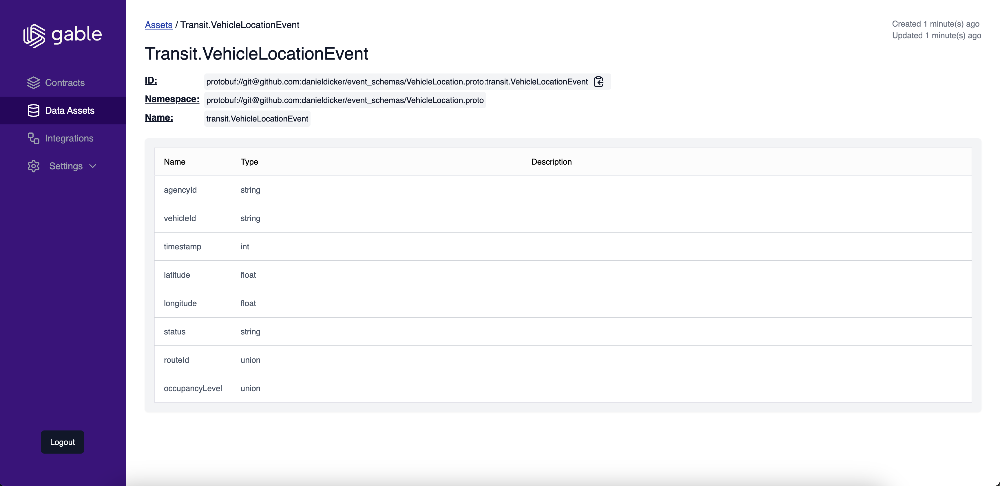
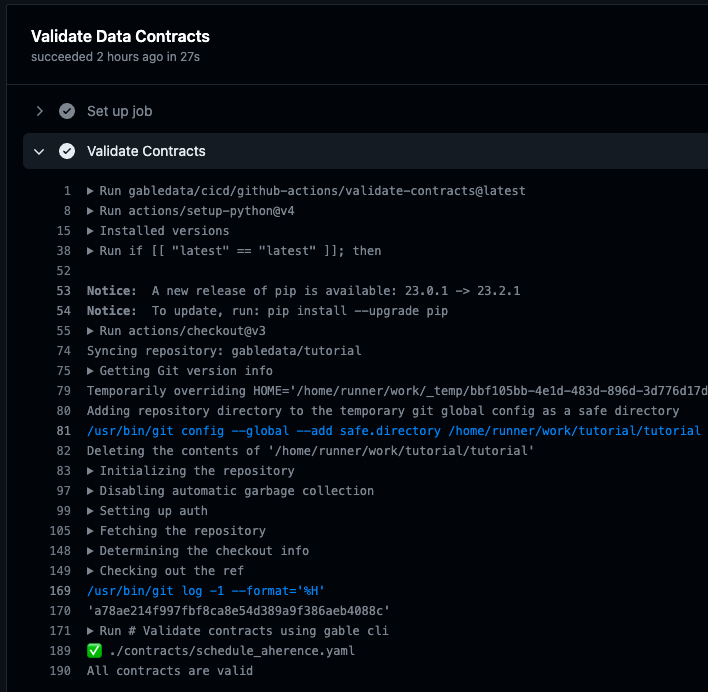
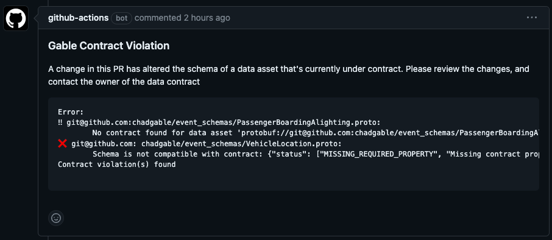

# Tutorial: Getting Started with Gable Platform

Welcome to the tutorial for Gable! In this tutorial, you will:

- Set up a forked tutorial repository with Gable and Github Actions
- Validate and publish a new data contract
- Attempt to make a breaking change to a data asset under contract

This tutorial utilizes Github Actions to validate & publish data contracts, register data assets, and detect contract violations, all using the Gable platform. If you would like to run a similar tutorial using just the CLI, you can check out the [CLI tutorial](./docs/cli.md).

## Step 1: Set up a forked tutorial repository

The tutorial repository is a small, self contained sample repository that lets you run through the end-to-end process of publishing a data contract and seeing that contract be enforced with Gable's platform. In this tutorial, you'll create a fork of the repository, configure your Gable credentials, and run the CI/CD workflows in Github Actions. If you're using the credentials from your sandbox environment, you can even run through this tutorial by making a personal fork of this repository.

### Fork this repository into your account

Navigate to the [tutorial repository](https://github.com/gabledata/tutorial) and click on the "Fork" button in the top-right corner of the repository's page.


A dialog may appear, asking you where to fork the repository (if you're part of any organizations). Choose your personal account (or the desired organization) to create the fork.

After clicking the create button, wait a moment as GitHub creates a copy of the repository under your account.

### Allow Github to Run Workflow

Github is cautious when running workflows for forked repositories so you need to grant explicit permission to run the workflows for the tutorial. Navigate to your forked repository in Github and click on the Actions tab. You'll see a message like the following:


Click on the "I understand my workflows, go ahead and enable them" button. This will give Github permission to run the CI/CD checks that come bundled with the tutorial.

### Get Your API Key

In order to connect the Github Actions to Gable, you need:

- The API endpoint associated with your organization, in the format `https://api.<organization>.gable.ai/`
- An API key that corresponds to the endpoint

You can find your API key by navigating to the `/settings` page of Gable. Under API Keys you can click `View` to reveal your API key.



### Setting up GABLE_API_KEY and GABLE_API_ENDPOINT secrets

Next, you will need to create the `GABLE_API_KEY` and `GABLE_API_ENDPOINT` secrets in your repository settings to configure Github Actions to talk to Gable.

Follow the Github instructions for [Creating encrypted secrets for a repository](https://docs.github.com/en/actions/security-guides/encrypted-secrets#creating-encrypted-secrets-for-a-repository) to create the `GABLE_API_KEY`and `GABLE_API_ENDPOINT` repository secrets.

### Clone the forked tutorial repository

The last setup step is to clone the forked repository to your local machine. Navigate to the main page of the forked repository within your GitHub account and click the "Code" button and copy either the HTTPS or SSH url for the repository.

Now open a terminal and run:

```bash
git clone COPIED_REPO_URL
cd tutorial
```

### Trigger Data Asset Registration

In order to kick off the first workflow to register the data assets, you'll need to push an empty commit to the repository. Run:

```bash
git commit --allow-empty -m "Run workflow"
git push
```

Once the workflow completes, you should be able to see the `ScheduleAdherenceEvent` contract in the Gable UI.

Congratulations! You've set up your tutorial repository and are ready to try out Gable's platform!

## Step 2: Creating Your First Data Contract

The tutorial repository includes three data asset files for a fake public transit agency. The data assets are two Protobuf files and one Avro file which represent different events for the public transit agency.

### Create a new branch to add the contract

You are going to create a new data contract in the tutorial repository. Just like code changes, rather than creating the contract in the `main` branch of the repository, it's best practice to create a new branch, and open a Pull Request for the changes. The PR allows others to comment on your changes, and also allows the Github Actions to validate the contract is syntactically correct before pushing changes.

You can either create a new branch using the Github web interface or using the git command line tools. This tutorial will walk through creating the branch using the git command line. In the tutorial repository on your local machine:

1. **Open a Terminal Window**: Navigate to the directory where your cloned tutorial repository is located
2. **Checkout a New Branch**: Use the following command to create and switch to a new branch called `first_contract`:

   ```bash
   git checkout -b first_contract
   ```

Great! Now you can start writing the contract!

### Write the data contract

You are going to create a data contract for the `VehicleLocation.proto` file, which represents a location and status tracking event for a vehicle in the transit agency. Writing a data contract involves creating a YAML file that declares the schema and semantics of the data following the [data contract specification](https://docs.gable.ai/data_contracts/what_are_data_contracts/data_contract_spec).

Contracts are associated with a specific data asset. When you first enabled Github Actions, it created three data assets in Gable for `PassengerBoardingAlightingEvent`, `ScheduleAdherenceEvent`, `VehicleLocationEvent`. You can navigate to the `Data Assets` page to view a list of your organization's assets.



You can click on the data asset where you can view its details including the ID Gable uses for the asset. You can click on the clipboard next to the ID to copy it into the contract below.



In the `contracts` directory of your local repository, create a file called `vehicle_location.yaml`. Copy and paste the following into the contents of that file:

```yaml
id: 6b7f4f6c-324c-4a26-9114-eefdee49d5c9
dataAssetResourceName: <DATA_ASSET_NAME_FROM_GABLE>
spec-version: 0.1.0
name: VehicleLocationEvent
namespace: Transit
doc: Real-time location and status of a transit vehicle
owner: chadgable@gable.ai
schema:
  - name: agencyId
    doc: The ID of the transit agency that operates this route.
    type: string32
  - name: vehicleId
    doc: The identifier of the specific vehicle
    type: string32
  - name: timestamp
    doc: Epoch timestamp of the vehicle location
    type: int64
  - name: latitude
    doc: The latitude of the vehicle location
    type: float32
  - name: longitude
    doc: The longitude of the vehicle location
    type: float32
  - name: status
    doc: Status of the vehicle at the time of the location update
    type: string32
```

**Make sure to replace the `<DATA_ASSET_NAME_FROM_ABOVE>` with the `VehicleLocation` data asset name from the UI**

This contract contains information on what data the contract applies to, who owns the contract, as well as the minimum expected schema for the data from the `VehicleLocationEvent`.

### Push Your Changes to Github

Now that you have created the contract, it is time to commit the change to the repository. To stage and commit your changes, run:

```bash
git add .
git commit -m "Added vehicle location data contract"
git push
```

### Validate the data contract

Before merging your changes back to the `main` branch, it is a good idea to create a Pull Request. Creating the Pull Request will serve two purposes:

- Allow others to review your newly-created data contract
- Allow the Github Action to validate the data contract is syntactically correct

To create the Pull Request:

1. Navigate to the main page of your forked tutorial repository in Github
2. Click on the "Pull requests" tab near the top of the page
3. Click the "New Pull Request" button
4. In the "base" dropdown, select the `main` branch
5. In the "compare" dropdown, select the `first_contract` branch that contains your new data contract
6. In the "Title" field, add `New VehicleLocationEvent Data Contract`
7. In the "Leave a comment" field, add the following:

   ```
   Adds a new data contract for the `VehicleLocationEvent` data.
   ```

8. Click the "Create Pull Request" button.

Once your PR is open, Gable's contract validation CI/CD check runs automatically to check for syntax errors in your data contracts. You can open the `Validate Data Contracts` check to see the status, if there were any errors in your contract they would appear here.



### Publish the Data Contract

Merge the Pull Request you opened. This will kick off the Github Action which publishes the contract.

Once the Github Action on the `main` branch has been run and the data contract has been published, navigate to the Gable UI and you should see your new data contract!

## Step 3: Preventing Breaking Data Changes

**NOTE**: This section relies on the `VehicleLocationEvent` data contract created in the previous step. Please complete that step if you have not already.

Now that there is a data contract in place for the `VehicleLocationEvent` data, every time a change is made to the Protobuf file, Gable checks to ensure that changes do not violate the contract. Let's try making a breaking change to the `VehicleLocationEvent`.

### Create a new branch

First off, pull changes down from the main branch to ensure that your repository is up-to-date. Create a new branch called `breaking_data_change`:

```bash
git checkout main
git pull
git checkout -b breaking_data_change
```

### Make a Breaking Change

Modify the `VehicleLocation.proto` file by changing the `status` column to `vehicleStatus`. This renames a field that is protected in the data contract, which is a violation of the contract.

Once the change has been saved, commit the change and push it to Github:

```bash
git add .
git commit -m "Rename VehicleLocationEvent status field"
git push
```

### Open a Pull Request

Now open a Pull Request for the proposed breaking change:

1. Navigate to the main page of your forked tutorial repository in Github
2. Click on the "Pull requests" tab near the top of the page
3. Click the "New Pull Request" button
4. In the "base" dropdown, select the `main` branch
5. In the "compare" dropdown, select the `breaking_data_change` branch that contains the breaking data change
6. In the "Title" field, add `Rename VehicleLocationEvent status field`
7. In the "Leave a comment" field, add the following:

   ```
   Rename the `status` field to `vehicleStatus` in `VehicleLocationEvent` data.
   ```

8. Click the "Create Pull Request" button.

### View Warning Message

The Github Action will validate the changes against existing data contracts. It will detect the change to the `VehicleLocationEvent` schema and post a message in the PR that this change breaks the existing data contract.



## Further Reading

Congratulations on creating your first data contract and validating data asset changes! Be sure to check out more of [Gable's documentation](https://docs.gable.ai) for more information on our platform!
